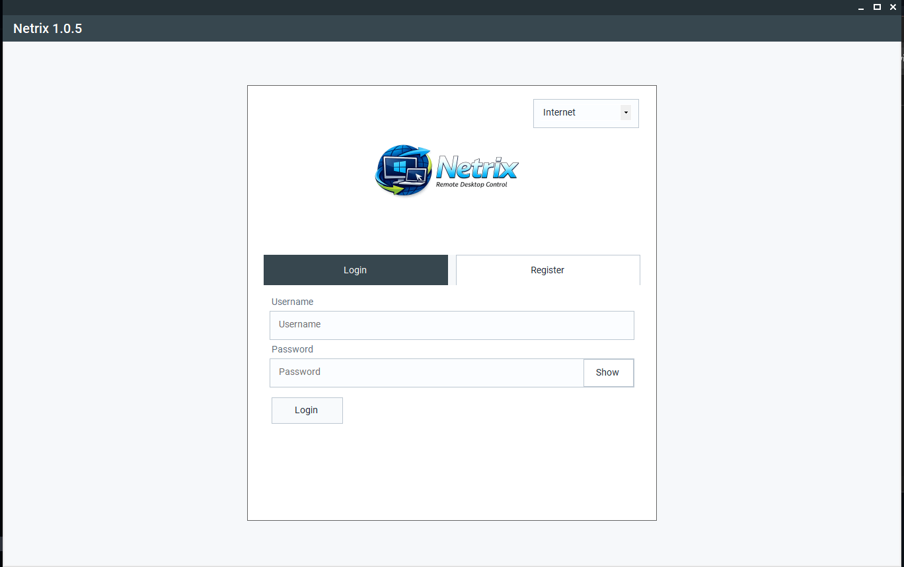

## Netrix
Version: 1.0.5

1.0.5 adds connection pooling, parallel health checks, dashboard auth, a /logout endpoint, and a simplified LAN mode UI on top of the 1.0.4 H.264/OpenH264 pipeline:

1. Host capture is still paced at 30 FPS.
2. The Windows client tries to encode screen frames with OpenH264 through `H264Sharp`.
3. Encrypted binary WebSocket packets now carry a codec field plus the encoded payload.
4. JPEG quality 45 at max width 1280px stays as a fallback when the H.264 native DLLs are unavailable.
5. The main server stays simple: it checks the sender is the host, then relays the encrypted binary frame.
6. LAN mode now uses a single IP field on the auth card. The client derives auth URL (`http://{ip}:8001`) and WebSocket URL (`ws://{ip}:8000/ws`) automatically — no separate URL fields needed.
7. Logout now calls `POST /logout` on the auth server to revoke the JWT session by JTI before clearing the local token.

## Docker Compose

Run the full server stack from this folder:

```bash
docker-compose up -d --build
docker-compose ps
```

Services:

1. `cloud` / PostgreSQL auth database: `localhost:5433`
2. `auth-server`: `http://localhost:8001` / `https://auth.threalwinky.id.vn`
3. `load-balancer`: `http://localhost:8002` / `https://load.threalwinky.id.vn`
4. `main-server-1`: `http://localhost:8000` / `wss://main.threalwinky.id.vn/ws`
5. `main-server-2`: `http://localhost:8003` / `wss://main2.threalwinky.id.vn/ws`
6. `main-server-3`: `http://localhost:8004` / `wss://main3.threalwinky.id.vn/ws`

The compose defaults match this Cloudflare Tunnel routing:

1. `auth.threalwinky.id.vn` -> `http://localhost:8001`
2. `load.threalwinky.id.vn` -> `http://localhost:8002`
3. `main.threalwinky.id.vn` -> `http://localhost:8000`
4. `main2.threalwinky.id.vn` -> `http://localhost:8003`
5. `main3.threalwinky.id.vn` -> `http://localhost:8004`

Optional environment file:

```bash
cp .env.cloudflare.example .env
docker-compose up -d --build
```

For LAN-only deployment without Cloudflare, override the public WebSocket URLs before starting compose:

```bash
NETRIX_MAIN1_PUBLIC_WS_URL=ws://YOUR_HOST_IP:8000/ws \
NETRIX_MAIN2_PUBLIC_WS_URL=ws://YOUR_HOST_IP:8003/ws \
NETRIX_MAIN3_PUBLIC_WS_URL=ws://YOUR_HOST_IP:8004/ws \
NETRIX_ALLOW_PRIVATE_WS_URLS=true \
docker-compose up -d --build
```

If `docker-compose logs -f` prints `KeyError: 'id'`, it is the old Python `docker-compose` v1 log watcher failing against newer Docker event output. The containers can still be healthy. Use one of these instead:

```bash
docker-compose ps
docker logs -f netrix-auth-server
docker logs -f netrix-load-balancer
docker logs -f netrix-main-server-1
```

